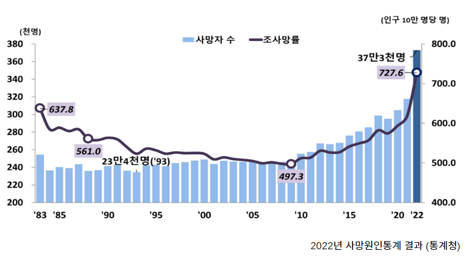

# 👥 팀원 소개

---


<div align="left">
  <table>
    <tr>
      <td align="center">
        <a href="https://github.com/KyhNaz">
          
        </a>
      </td>
<td align="center">
        <a href="https://github.com/phantomkos">
          
        </a>
      </td>
      <td align="center">
        <a href="https://github.com/Somang-Kang">
          
        </a>
      </td>
      <td align="center">
        <a href="https://github.com/neymaru">
          
        </a>
      </td>
      <td align="center">
        <a href="https://github.com/2dilution2">
          
        </a>
      </td>
      <td align="center">
        <a href="https://github.com/rose129">
          
        </a>
      </td>
    </tr>
    <tr>
      <td align="center">
        <a href="https://github.com/KyhNaz">
          김영훈
        </a>
      </td>
     <td align="center">
        <a href="https://github.com/phantomkos">
          권오성
        </a>
      </td>
      <td align="center">
        <a href="https://github.com/Somang-Kang">
          강소망
        </a>
      </td>
      <td align="center">
        <a href="https://github.com/neymaru">
          김성현
        </a>
      </td>
      <td align="center">
        <a href="https://github.com/2dilution2">
          이희석
        </a>
      </td>
      <td align="center">
        <a href="https://github.com/rose129">
          한지혜
        </a>
      </td>
    </tr>
  </table>
</div>

<br/>
<div id="6"></div>


# 🌟 프로젝트 소개

---

## 프로젝트 배경

<div style="display: flex; justify-content: space-around; align-items: center;">
    <div style="text-align: center;">
        
        <p style="vertical-align: top;">1. 매년 증가하는 사망률</p>
    </div>
    <div style="text-align: center;">
        
        <p style="vertical-align: top;">2. 애도 시간 부족</p>
    </div>
</div>


사회적으로 매년 증가하는 사망자 수에 대응하여, 우리의 서비스는 코로나나 각종 사고로 인해 갑작스럽게 이별을 경험하고, 슬픔을 충분히 처리할 시간조차 갖지 못하는 이들에게 필요한 지지와 위로를 제공합니다. 

이러한 상황들은 개인에게 극심한 스트레스와 정신적 부담을 가져오며, 이를 완화시키는 것이 우리 서비스의 핵심 목표입니다.

## 프로젝트 주제

> **AI를 활용한 고인과의 채팅 및 음성 복원 서비스**
> 

<div style="display: flex; flex-wrap: wrap; justify-content: space-around; align-items: center;">
    <div style="text-align: center; margin: 10px;">
        
    </div>
    <div style="text-align: center; margin: 10px;">
        
    </div>
    <div style="text-align: center; margin: 10px;">
        
    </div>
    <div style="text-align: center; margin: 10px;">
        
    </div>
</div>


1. 고인의 텍스트 스타일을 재현하는 채팅 서비스
    
    LLM을 활용하여 고인의 텍스트 스타일을 재현하고, 채팅을 통해 실시간으로 상호작용하며 고인에 대한 그리움을 달랠 수 있습니다.
    
2. 고인의 목소리를 재현하는 음성 복원 서비스
    
    음성 복원 모델로 고인의 목소리를 재현하여 더욱 생생한 대화 경험을 제공합니다. 
    

# ⚙️ 개발환경

---

**OS**: Linux Ubuntu 22.04

**Front-end**: React Native, JavaScript, Expo

**Back-end**: Python 3.10, FastAPI

**API**: Clova speech API, OpenAI API, Kakao Login API

**DB**: MySQL, MongoDB, Docker, Docker-compose

**Tool**: Visual Studio Code, MySQL Workbench, MongoDB Compass, Docker Desktop, Swagger UI, Postman, Figma, notion

# 🗂 디렉토리 구조

---

```bash
vos-server/
│
├── backend/
│   ├── app/
│   │   ├── ai_models/
│   │   │   ├── speaker_identification/
│   │   │        ├── clova_speech.py
│   │   │        └── postprocessing.py
│   │   │   ├── text_generation/
│   │   │        ├── characteristic_generation.py
│   │   │        ├── chat_generation.py
│   │   │        ├── crime_prevention.py
│   │   │        ├── preprocessing.py
│   │   │        ├── run_prompt.py
│   │   │        └── token_limit.py
│   │   │   └── voice_cloning/
│   │   │        └── xtts.py
│   │   │
│   │   ├── api/
│   │   │   ├── admin.py
│   │   │   ├── chat.py
│   │   │   ├── star.py
│   │   │   └── user.py
│   │   │
│   │   ├── database/
│   │   │   ├── connection.py
│   │   │   ├── orm.py
│   │   │   └── repository.py
│   │   │
│   │   ├── resources/
│   │   │   ├── audio/
│   │   │   ├── images/
│   │   │   └── text/
│   │   │        ├── crime_prevention.txt
│   │   │        ├── extract_characteristic.txt
│   │   │        └── system_input.txt
│   │   │
│   │   ├── schema/
│   │   │   ├── request.py
│   │   │   └── response.py
│   │   │
│   │   ├── service/
│   │   │   ├── ai_serving.py
│   │   │   ├── auth.py
│   │   │   └── s3_service.py
│   │   │
│   │   ├── main.py
│   │   └── security.py
│   │
│   └── requirements.txt
│
├── .env
├── .gitignore
├── docker-compose.yml
└── README.md
```

# ⛓️ 서비스 파이프라인
---


# 🧬 시스템 아키텍처

---


# 📱 페이지별 기능

---

### 🔗 로그인 화면

- 모바일 애플리케이션 접속 초기화면
    - 기존 로그인 및 엑세스 토큰 유효기간 내 앱 실행 시 바로 고인과의 채팅 리스트 화면 진입
- 카카오 로그인 API를 통한 소셜 로그인 구현


### 🔗 회원가입

- 이메일 주소 형태로 아이디 생성
- 이메일 중복 확인 기능을 통해 기존 DB에 존재하지 않는 아이디 일 경우 가입 가능하도록 구현
- ‘비밀번호 확인’란을 통해 비밀번호 일치 여부 판단
- 약관 동의 시 회원가입 가능


### 🔗 별(고인) 생성

- 고인의 기본 정보, 특징(프롬프트 엔지니어링의 페르소나 데이터), 채팅 스타일 추출 및 기억 학습을 위한 카카오톡 대화 파일 모두 입력하여야 별 생성 가능
- 업로드 된 텍스트 파일의 특징 추출 및 프롬프트 데이터 DB 저장


### 🔗 목소리 분리

- 고인의 음성이 담긴 오디오 파일을 입력받고 AI 모델을 통해 화자 분리
    - 여러 사람의 목소리가 담긴 파일도 업로드 및 분리 가능
    - 화자의 수 만큼 오디오 리스트가 생기고 화자의 분리된 음성 파일 중 가장 긴 재생 시간의 오디오를 샘플로 제공, 재생 버튼을 통해 유저가 하나씩 재생함으로써 화자 구분 및 선택 가능
- 선택된 화자의 음성을 AI 모델을 통해 특징 추출 및 벡터 데이터 DB 저장


### 🔗 채팅 리스트

- 별(고인)이 생성되면 채팅 리스트에 생성된 별의 수만큼 채팅 리스트 표기
- 채팅 전
    - “메시지가 없습니다.” 문구 표기
- 채팅 후
    - 마지막 채팅을 DB에서 조회 후 표기

<div style="display: flex;">
    
    
</div>


### 🔗 채팅

- 채팅 답변 생성
    - 고인의 채팅 스타일 재현 및 기억 기반의 메시지를 생성해 실시간 채팅 기능 구현


### 🔗 음성 복원

- 메시지 버튼을 1초 이상 클릭함으로써 팝업 메뉴가 등장하고 ‘목소리 듣기’ 버튼 클릭 시 해당 텍스트를 고인의 목소리로 재현하는 오디오 재생


### 🔗 보이스 피싱 및 범죄 탐지

- 금전, 금융 관련 대화 내용 탐지 시 “의심스러운 메시지가 감지되었습니다. 다시 메시지를 전송해주세요.” 라는 메시지를 띄우며 부적절한 응답으로 인한 대화가 진행되지 않도록 차단 기능 구현


# 💻 핵심 기술

---

## Frontend

- 고인의 이미지를 모바일기기의 캐시파일로 임시 저장 후 채팅방에서 불러오기
- 메세지를  long press 시 리스트 팝업, 목소리 듣기기능 추가
- Base64로 인코딩된 화자별 음성 데이터를 expo의 Audio를 이용하여 프론트에서 재생

## Backend

- 채팅방 입장 시 웹 소켓 실행
- 회원가입 시 비밀번호 hash 암호화 후 DB 저장
- HS256 알고리즘 사용 jwt 생성
- 로그인 시 비밀번호 bcrypt 인코딩 및 plain, hash password 검증, access token 발급
- access token 만료기간 설정으로 해당 기간 동안 로그인 유지 및 API 호출 가능
- Database ORM(SQLAlchemy) 적용
- API 실행 시 유저 검증 및 조회 Dependency Injection
- 데이터베이스 가상 컨테이너 운영(MySQL, MongoDB)
- 유저, 고인 이미지 AWS S3 저장
- Voice Cloning 모델 서빙
  - 고인 음성 데이터로부터 음성 특징 vector 데이터 추출 및 데이터베이스 저장 → 음성 재생 시 데이터 조회 후 음성 재생 시 model, text, vector 데이터를 기반으로 음성 복원

## AI


📑 **Text Generation (Prompt Engineering)**

고인의 채팅 스타일을 반영하여 텍스트 답변을 생성하는 프롬프트 제작

- 텍스트 특징 추출 프롬프트 (GPT-3.5)
    
    고인의 텍스트에서 특징적인 요소를 10가지 내외로 추출
    
    추출된 특징은 채팅 생성 프롬프트에 사용
    
- 채팅 생성 프롬프트 (GPT-4)
    
    고인의 채팅스타일을 묘사하여 고인의 채팅스타일과 유사한 답변을 생성
    
    고인의 페르소나를 주입하고, chain-of-thought / least-to-most 등의 기법을 수행
    
- 보이스피싱 방지 프롬프트 (GPT-3.5)
    
    본 서비스가 범죄에 악용되는 것을 방지하기 위해 채팅 내용에서 의심스러운 메시지를 감지
    

**🎙️ Speaker Identification**

다수의 화자가 담긴 음성파일에서 고인의 목소리만 추출

|  | Svoice | SpeechBrain | VoiceFilter | Clova speech AI |
| --- | --- | --- | --- | --- |
| model weight 제공 | O | O | O | O |
| 3명이상 분리 | O | X | X | O |
| confidence 제공 | X | X | X | O |

→ 3명 이상의 화자 분리 가능 여부 및 성능을 고려하여 **Clova speech AI** 선정

**🔊 Voice cloning**

추출된 고인의 음성과 생성된 텍스트를 활용해 고인 목소리 복원

|  | SCE-TTS | Bark |  vall-e | xtts-v2 |
| --- | --- | --- | --- | --- |
| zero-shot | x | o | o | o |
| 한국어 지원 | o | x | x | o |
| inference data | 3시간 | 3초 | 3초 | 3초 |

→ 한국어 지원 및 음성 복원 성능을 고려하여 **xtts-v2** 선정

# ↘️ Voice of the star 실행

---

### 1. 설치 (Linux version)

1-1. pytorch 설치

```python
pip3 install torch torchvision torchaudio --index-url https://download.pytorch.org/whl/cpu
```

1-2. requirements 설치

```python
pip install -r backend/requirements.txt
```

1-3. ffmpeg 설치

```python
sudo apt install ffmpeg
```

### 2. 프롬프트 파일 추가

> 3가지 프롬프트 파일을 각각의 경로에 추가합니다.
> 
> 
> **PROMPT_FILE_PATH** (고인 텍스트 특징을 추출하는 프롬프트)
> 
> VOS-server/backend/app/resources/text/extract_characteristic.txt
> 
> **SYSTEM_INPUT_PATH** (고인의 텍스트 스타일과 유사한 채팅 응답을 유도하는 프롬프트)
> 
> VOS-server/backend/app/resources/text/system_input.txt
> 
> **VOICE_PHISHING_PROMPT_PATH** (보이스피싱 감지 프롬프트)
> 
> VOS-server/backend/app/resources/text/crime_prevention.txt
> 

### 3. .env 파일 세팅

.env 파일 내 환경변수 세팅이 필요합니다.

### 4. 서버 실행

```python
cd backend/app
uvicorn main:app --host 0.0.0.0 --port 8000
```

### 5. Docker 컨테이너 생성 및 실행

```json
docker-compose up -d
```

# 📌 Reference

---

### Front-end Details

- [front-end README](https://github.com/Think-Tank-6/VOS-client)

### AI references

- [https://github.com/coqui-ai/TTS](https://github.com/coqui-ai/TTS)
- [https://www.ncloud.com/product/aiService/clovaSpeech](https://www.ncloud.com/product/aiService/clovaSpeech)
- [https://openai.com/product](https://openai.com/product)
